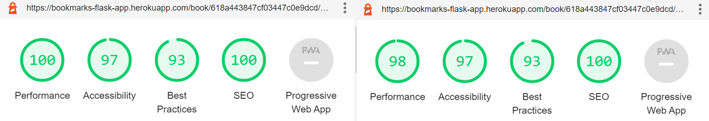
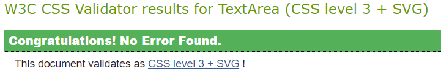

# **BookMarks** - Testing

<p align="center">
    
</p>

[README.md](README.md)

[Live Site](https://bookmarks-flask-app.herokuapp.com/home)

## **Table of contents**

- [**BookMarks** - Testing](#bookmarks---testing)
  - [**Table of contents**](#table-of-contents)
  - [**User Testing**](#user-testing)
  - [**User Stories Testing**](#user-stories-testing)
  - [**Performance**](#performance)
  - [**Code Validation**](#code-validation)
    - [HTML validation](#html-validation)
    - [CSS validation](#css-validation)
    - [JS validation](#js-validation)
    - [Python validation](#python-validation)
  - [**Manual Testing**](#manual-testing)
  - [**Responsive Design**](#responsive-design)
  - [**Bugs**](#bugs)

## **User Testing**

Throughout this project I conducted 'over the shoulder' user tests to asses the usability, readability and functionality of the site and it's features. These tests involved allowing test users to freely use the site while observing to gage how they were engaging with elements to determine if everything was functioning as intended. I also gathered feedback as to how users felt about certain aspects in order to improve the UX. I was able to improve the useability of the site inv various ways thanks to their feedback, such as -

- Removing the prompt to add a review if a user has already submitted one.
- Maintain consistency of hover effects on interactive elements.
- Buttons to move to register from login and vice versa without accessing the navbar to improve mobile useability.
- Star rating values should always be displayed out of their total potential value to improve readability.
- Give feedback of search term and number of results after entering a search so as not to leave a user on a empty page with no explanation.
- More friendly exit message after logging out.
- Books added by a user should appear on their profile page.

These changes along with several small styling tweaks have helped make this a more complete and user friendly product.

## **User Stories Testing**

1. As a regular user of this site I want to be able to -

- Find and learn about books
  - The site homepage displays a live update on the highest rated books on the site allowing the user to see what books are currently popular. In addition to this the books page shows all added books and allows the user to search for specific terms within a books title, author, genre and summary fields. Book details pages show full descriptions and details for all titles.

<p align="center">
    
</p>

- Find a books average rating
  - All book preview cards and book details pages display the books average rating out of 5 to two decimal places along with a graphical representation of this rating.

<p align="center">
    
</p>

- Search for books by parameters such as title, author and genre
  - The books page allows the user to search for specific terms within a books title, author, genre and summary fields.

<p align="center">
    
</p>

- Find the currently highest rated books
  - The site home page shows the current top six titles sorted by average user rating.

<p align="center">
    
</p>

- Add books to the site
  - User can add books to the site by clicking on the prompt from the books page which takes them to a form to add details to the new entry.

<p align="center">
    
</p>
<p align="center">
    
</p>

- Write and post reviews for books
  - logged in users that have not already added a review to the current book are prompted to add a review via a card below the books details. Clicking this prompt opens a modal where the user can add the details of their review and select a star rating.

<p align="center">
    
</p>

<p align="center">
    
</p>

- View all reviews I have posted
  -All review written buy a user are displayed on the users profile page.

<p align="center">
    
</p>

- Edit/delete reviews that I have posted
  - User reviews can be edited or deleted by the review author from the reviews section of the pertaining book.

<p align="center">
    
</p>

- View reviews other people have written
  - Any/All reviews for a book are displayed on the books details page.

<p align="center">
    
</p>

- Edit/delete books I have added
  - Controls to delete/edit books can be located at the top of a books details page for the user who added the book and site admin.

<p align="center">
    
</p>

- Log in to my account
  - Users can navigate to the login page from the navbar or from a prompt on any book details page or the registration page. There they will need to enter their account details into a login form to access their account.

<p align="center">
    
</p>
<p align="center">
    
</p>

- Log out of my account
  - User can select to log out from the navigation bar located at the top of any page, or the expandable sidenav for mobile users.

<p align="center">
    
</p>
<p align="center">
    
</p>

2. As a first time visiter to this site I want to be able to -

- Easily understand the purpose of the site
  - The site homepage predominantly displays book preview cards which show book cover art, titles, authors and truncated summaries. This combines with the title and 'Top Rated Books' banner should make the sites intentions clear and obvious.

<p align="center">
    
</p>

- Learn about specific books
  - The books page allows the user to search for specific terms within a books title, author, genre and summary fields. This would allow a user ot find any currently added book by Title or author with ease.

<p align="center">
    
</p>

- View reviews other people have written
  - Any/All reviews for a book are displayed on the books details page.

<p align="center">
    
</p>

- Create an account
  - Users can navigate to the register page from the navbar or from a prompt on any book details page or the login page. There they will be prompted to complete a registration form to register an account.

<p align="center">
    
</p>
<p align="center">
    
</p>

3. As an admin of this site I want to be able to -

- Login to an admin account
  - Users can navigate to the login page from the navbar or from a prompt on any book details page or the registration page. There they will need to enter the admin account details into a login form to access their account.

<p align="center">
    
</p>
<p align="center">
    
</p>

- Log out of an admin account
  - User can select to log out from the navigation bar located at the top of any page, or the expandable sidenav for mobile users.

<p align="center">
    
</p>
<p align="center">
    
</p>

- Edit the details of a book
- Delete a book
  - The site admin account has access to the delete/edit controls for all books. These controls can be located at the top of any books details page.

<p align="center">
    
</p>

- Delete a user review (potentially offensive content)
  - The site admin account has access to delete controls for all user reviews. These controls are located at the bottom of the expandable section of any user review and should be used to remove any offensive content.

<p align="center">
    
</p>

## **Performance**

Site performance was tested using Google Chrome's Lighthouse tool. All pages scored high across all parameters though performance for mobile devices was slightly lower on pages with images as images are user added and not optimized or size adjusted. These are the lighthouse results -

_Each image shows the results for a page for both desktop (left) and mobile (right)_

1. /home

<p align="center">
    
</p>

2. /books

<p align="center">
    
</p>

3. /book/<book_id>/view

<p align="center">
    
</p>

4. /book/add

<p align="center">
    
</p>

5. /book/<book_id>/edit

<p align="center">
    
</p>

6. /book/<book_id>/review/edit

<p align="center">
    
</p>

7. /profile

<p align="center">
    
</p>

8. /login

<p align="center">
    
</p>

9. /register

<p align="center">
    
</p>

## **Code Validation**

### HTML validation

All HTML was tested using [Nu HTML Checker](https://validator.w3.org/nu/) and returned no errors.

<p align="center">
    
</p>

### CSS validation

All custom CSS code was tested using the [Jigsaw css validator](https://jigsaw.w3.org/css-validator/) and showed no errors.

<p align="center">
    
</p>

### JS validation

All Javascript code was tested using [Beautify Tool Javascript validator](https://beautifytools.com/javascript-validator.php) and returned no errors.

### Python validation

All Python was tested and checked against pep8 standards using pylint in vscode and returned no errors.

## **Manual Testing**

To fully test my application in both the development and production environments I devised a series of manual checks to assure all aspect of the site work as intended. By completing these tests in the development and production environments concurrently I can also easy identify any differences between the two.

1. Navbar - all pages (desktop)

- Check navigation links are displayed as expected and lead to the intended pages when selected.
  - Logged out: Home, Books, Sign In, Register
  - Logged In: Home Books, Profile, Sign out
- Current page is highlighted in navbar with active styling.
- Brand logo directs user to homepage when clicked.

2. Navbar - all pages (mobile)

- Sidenav opens when the burger icon is clicked.
- Check navigation links are displayed as expected and lead to the intended pages when selected.
  - Logged out: Home, Books, Sign In, Register
  - Logged In: Home Books, Profile, Sign out
- Current page is highlighted in navbar with active styling.
- Brand logo directs user to homepage when clicked.

3. Footer - all pages

- Check footer is displayed at the bottom of the page and contains the bookmarks copyright statement and social media link icons for facebook, instagram and twitter.
- Footer social media links open on new pages to the expected destination pages.

4. Home page (/home)

- Check expected sections are displayed (Top rated books, Editors picks)
- Top rated books contains the top six highest rated books. Book preview cards are displayed for each book.
- Book preview cards contain book title, average star rating, author name, truncated description and book cover image.
- Any cover image source url which is an empty string has been replaced with the placeholder image url.
- Book preview cards link to the relevant book details page when clicked.
- Editors picks section contains two picks each showing info for book title and author, picked by, genre, editors review and a book preview card for the relevant book.

5. All books (/books)

- Logged in: Add new book prompt is displayed and takes the user to the add book page when clicked.
- logged out: Add new book prompt is not displayed.
- Search
  - Search bar is displayed at the top of the page.
  - Entering a search with no value displays a prompt to the user to enter input.
  - Entering a value into the search field displays to the user the number of matches the search received and the search term used. Book preview cards are also displayed for each matching result.
  - Book preview cards contain book title, average star rating, author name, truncated description and book cover image.
  - Book preview cards link to the relevant book details page when clicked.
- Preview cards for all books added to the database are displayed.
- Book preview cards contain book title, average star rating, author name, truncated description and book cover image.
- Book preview cards link to the relevant book details page when clicked.

6. Add Book (/book/add)

- Attempting to access this page while logged out redirects to the login page.
- Add book page displays a data input form to add a new book to the site.
- Input fields are Title, Author, Genre, image URL and Summary.
- All fields except image URL must contain data for the form to be submitted.
- Image URL may be left blank.
- Trying to submit the form with any blank mandatory fields prompts the user to input data to these fields.
- Submitting the form takes the user to the newly generated book details page (/book/<book_id>/view) for the book they have added.
- An invalid image URL submitted with a book is replaced with an empty string.

7. Book details (/book/<book_id>/view)

- Logged in as the user who added the current book to the site or admin:
  - Card containing book delete and edit controls is rendered at the top of the page.
  - Clicking the delete book button opens a modal asking the user to confirm deletion or cancel action.
  - Clicking off the modal or selecting the cancel button closes the modal.
  - Clicking the delete button removes the book and all related data from the database (/book/<book_id>/delete).
- Logged out: Delete and edit controls are not rendered to page.
- Book details card contains book title, average star rating, author name, complete book description, 'added by' and book cover image.
- Any blank image url values have been replaced with a placeholder image url.
- Logged in as a user that has not previously submitted a review for the current book:
  - Card prompting the user to add a review is rendered bellow the books details section.
  - Clicking the add a review button opens the add a review modal
  - Add review modal contains a prompt asking users what they thought of <book.title>
  - Add review modal contains form with text area input for review body and radio buttons for selecting a star rating.
  - All fields must contain valid data before a submission can be made.
  - Successfully submitting a review redirects the user to the books details details page now containing the new review and display a flash massage confirming the successful submission.
- If current user is not logged in or has already submitted a review for this book no prompt is displayed.
- Any reviews for the current book are displayed after all other page sections as expandable cards.
  - Closed cards display correctly the name of the user who submitted the review and the star rating they gave.
  - Clicking on the review causes it to expand and show the body of the review bellow other details.
  - Only one review may be open at a time. Clicking on the review again or opening another closes the currently open review.
- Logged in admin user:
  - All expanded reviews contain a delete review button.
  - Clicking the delete review button opens a modal asking the user to confirm deletion or cancel action.
  - Clicking off the modal or selecting the cancel button closes the modal.
  - Clicking the delete button removes the review from the database (/book/<book_id>/review/delete) and re renders the page sans the deleted review.
- Logged in user who has submitted a review:
  - The review submitted by the current user displays edit and delete controls when expanded.
  - Clicking the delete review button opens a modal asking the user to confirm deletion or cancel action.
  - Clicking off the modal or selecting the cancel button closes the modal.
  - Clicking the delete button removes the review from the database (/book/<book_id>/review/delete) and re renders the page sans the deleted review.
  - Clicking the edit review button redirects the user to the edit review page.

8. Edit book (/book/<book_id>/edit>)

- Attempting to access this page while logged out redirects to the login page.
- Edit book page displays a data input form in the same format as the add book form.
- Input fields are Title, Author, Genre, image URL and Summary and are pre populated with the info from the book that has been selected to edit.
- All fields except image URL must contain data for the form to be submitted.
- Image URL may be left blank.
- Trying to submit the form with any blank mandatory fields prompts the user to input data to these fields.
- Submitting the form redirects the user to the book details page which displays the updated info.
- An invalid image URL submitted with a book is replaced with an empty string.

9.  Edit review (/book/<book_id>/edit)

- Attempting to access this page while logged out redirects to the login page.
- Edit review page displays a data input form in the same format as the add review form.
- Input fields are review body and star rating and are pre populated with the info from the review that has been selected to edit.
- Add review modal contains a prompt asking users what they thought of <book.title>
- Add review modal contains a form with a text area input for review body and radio buttons for selecting a star rating.
- All fields must contain valid data before a submission can be made.
- Successfully submitting a review redirects the user to the books details details page now containing the updated info for the review and display a flash massage confirming the successful update.

10. Profile (/profile)

- Attempting to access this page while logged out redirects to the login page.
- The first section of the profile page contains a banner displaying the current users username and an accurate count of the users total submitted reviews.
- Any reviews the user has submitted are displayed after the 'User reviews' banner as expandable cards.
- Closed cards display correctly the name of the book they were submitted to and the star rating that was given.
- Clicking on the review causes it to expand and show the body of the review bellow other details.
- Only one review may be open at a time. Clicking on the review again or opening another closes the currently open review.
- Any books the user has submitted is displayed a book preview cards under the Added books banner.
- Book preview cards contain book title, average star rating, author name, truncated description and book cover image.
- Any cover image source url which is an empty string has been replaced with the placeholder image url.
- Book preview cards link to the relevant book details page when clicked.

11. Sign in (/login)

- Attempting to access this page while logged in redirect sto the home page.
- Login page displays a data input form with fields for Username and Password and a submission button.
- Invalid data:
  - Submitting the form with empty fields or fields which do not pass the form validation, prompts the user to check/enter data to relevant fields
  - Submitting the form with with an invalid username redirect to the login page and display a flash message informing the user
  - Submitting the form with with an invalid password redirect to the login page and display a flash message informing the user
  - Submitting the form with with an invalid username and password redirect to the login page and display a flash message informing the user
- Valid data
  - Submitting the form with a valid username and password logs the user in and redirects to the home page
  - A flash message is displayed welcoming the user
- A prompt for non registered users to register and a button linking to the registration page render under the sign in form. Clicking the link redirects to the registration page.

12. Register (/register)

- Attempting to access this page while logged in redirects to the home page.
- Register page displays a data input form with fields for Username and Password and a submission button.
- Invalid data:
  - Submitting the form with empty fields or fields which do not pass the form validation, prompts the user to check/enter data to relevant fields
  - Attempting to register with a username already in user redirects to the login page and displays a flash message informing the user that the name is in use.
- Valid data
  - Submitting the form with a valid username and password registers the new users data, logs the user in and redirects to the home page
  - A flash message is displayed confirming successful registration.

13. Sign out (/logout)

- Sign out is only available from the navbar when logged in.
- Selecting Sign out removes the user from session and redirect them to the homepage.
- A flash message is displayed thanking the user for visiting.

I have completed these checks for both the development and production environments and found all site elements, CRUD functionality and layout/styling all worked as intended.

## **Responsive Design**

To test the responsive design of my site I checked each page in various sizes using Google Chromes Dev tools. Chrome dev tools allow you to virtually scale your site to a variety of common device types and also allows you to input specific, custom display dimensions to test any screen size. Using this tool I was able to render each page in a variety of screen sizes and check the results. For each resolution I checked for:

- Clearly legible text
- Consistent styling
- No blocked or hidden elements

Here are some screen shots demonstrating this for the site homepage

- Mobile (375-667px)
<p align="center">
    
</p>
- Tablet (768-1024px)
<p align="center">
    
</p>
- Desktop (1920-1080px)
<p align="center">
    
</p>

## **Bugs**

- The intention of this code was to take a list of all books and return an array containing only reviews from those books written by a specific user. In my first iteration of the code some user profiles were producing an 'IndexError: list index out of range'. To test this error I printed the results at each stage and found the cause. This error was due to the assumption in my code that the index I would be referencing to add the books title to the 'user_reviews' array would be the same as the current index of the for reviews loop. This would only be true under very specific conditions and would not produce the desired, consistent effect. To resolve this issue I created a separate value to allow me to store, update, then append the data to the 'user_reviews' array before the end of the loop without relying on the loop index.

original code

```py
user_reviews = []
for book in books:
    for i in range(len(book["reviews"])):
        if book["reviews"][i]["author"] == username:
            user_reviews.append(book["reviews"][i])
            user_reviews[i]["book_title"] = book["title"]
```

updated code

```py
user_reviews = []
for book in books:
    for i in range(len(book["reviews"])):
        print(book["reviews"][i]["author"])
        if book["reviews"][i]["author"] == username:
            values = book["reviews"][i]
            values["book_title"] = book["title"]
            user_reviews.append(values)
```

- During testing I discovered that logging out was causing a KeyError. Reading the error message I discovered this was due to the server checking for a 'user' key in session directly after removing this key. The logout route was directing to the login page which was checking for a user in session. Searching for a key that did not exist was causing the error. I instead decided to direct a user back to the homepage instead after logging out as it is unlikely for a user to want to log back in directly after having logged out.
  - The function I created to test if a user was logged in or not was also causing a key error when the login route was called with either an incorrect username or password. By placing the session check inside a try except block I was able to return 'False' for any state other than a logged in user resolving the error.
  ```py
  def is_logged_in():
  """Return true if user is in session"""
  try:
      if session and session["user"]:
          return True
      return False
  except:
      return False
  ```
